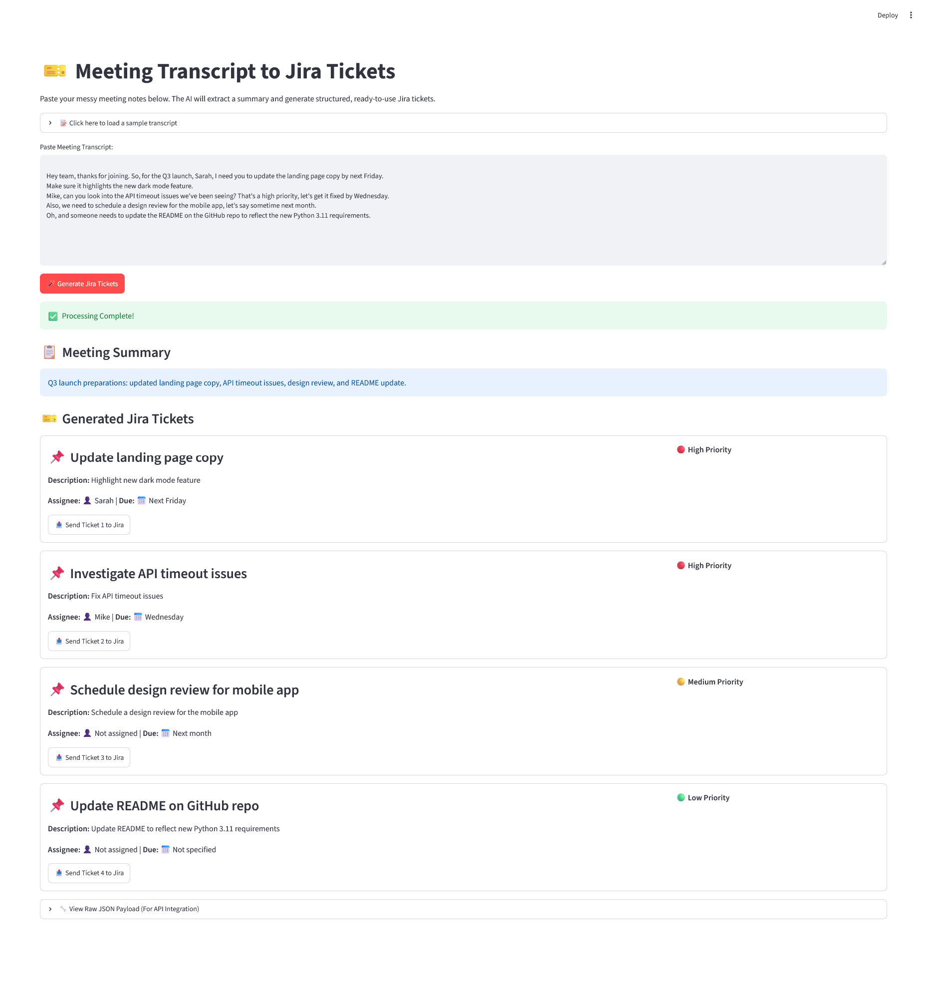

# AI Jira Generator

Meeting Transcript to Jira Tickets is a Streamlit app that turns messy meeting notes into a structured summary and Jira-ready action items.

## Screenshot

## Run Locally

1. Create and activate a Python virtual environment.
2. Install dependencies from your project setup.
3. Set `GROQ_API_KEY` in a local `.env` file.
4. Start the app with Streamlit.

## Project File

- `app.py` contains the Streamlit app and the ticket generation flow.